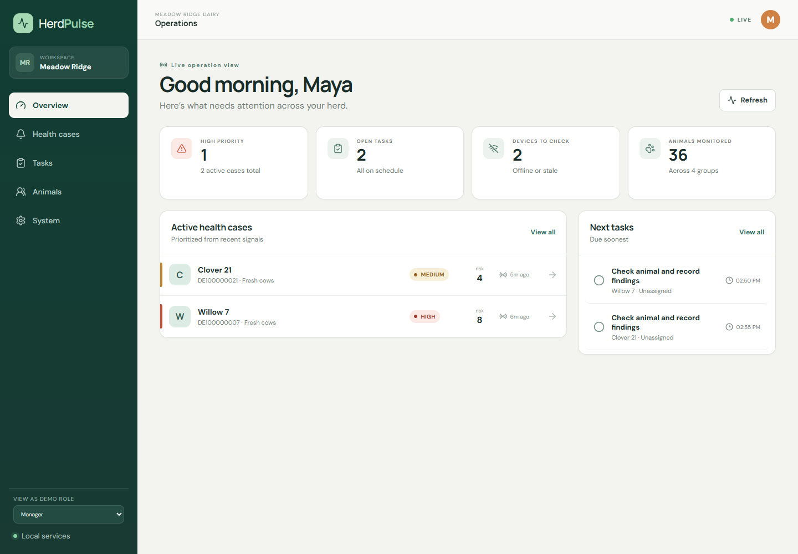
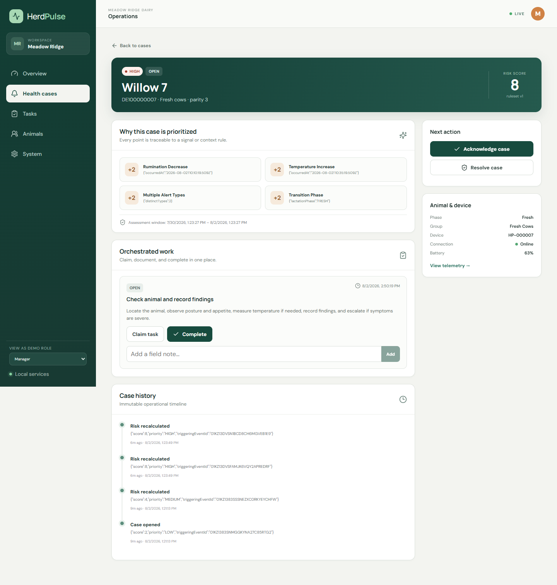
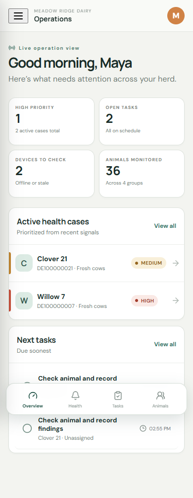
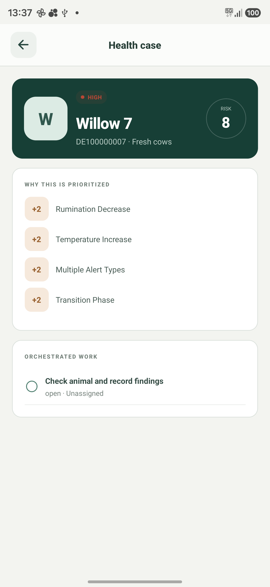
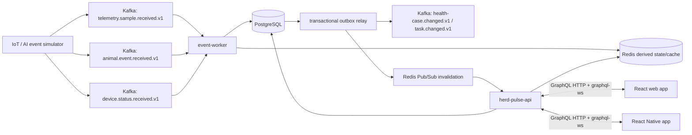

# HerdPulse

HerdPulse is a completed local portfolio project for real-time herd-health prioritization and barn-work orchestration. The repository includes the working event pipeline, GraphQL API, responsive React client, focused Expo companion, local identity/infrastructure, deterministic demo, failure-recovery exercises, lean tests, operational notes, and reviewed screenshots. It is not deployed and does not use hosted automation.

> Priorities are transparent operational decision support for a fictional demo herd. They are not veterinary diagnoses or clinically validated recommendations.

## See it working

| Responsive web dashboard                                               | Explainable case workflow                                        |
| ---------------------------------------------------------------------- | ---------------------------------------------------------------- |
|          |    |
|  |  |

The Expo companion was visually verified on the USB-attached Samsung Android phone. The React Native code is kept iOS-compatible, but iOS verification is intentionally not claimed.

## Product thesis

HerdPulse is a real-time herd-health alert and barn-work orchestration platform. An upstream IoT/AI system already produces telemetry and animal-health events. HerdPulse consumes those inputs, correlates recent signals for each animal, prioritizes animals that need attention, creates work from farm-specific standard operating procedures (SOPs), and keeps web clients current in real time.

This is not a generic farm-management CRUD application and it is not a clinical prediction system. Its core engineering problems are event processing, explainable prioritization, multi-tenant authorization, operational workflow, time-series reads, failure recovery, and real-time client reconciliation.

## Goals

HerdPulse's implemented core:

1. Consume versioned telemetry and discrete animal events from Kafka.
2. Correlate events for the same animal over a configurable 72-hour window.
3. Calculate an explainable low, medium, or high priority using recent events, lactation phase, and farm settings.
4. Process duplicates, replays, late events, and out-of-order events safely.
5. Open or update health cases and create tasks from versioned SOPs.
6. Let authorized workers acknowledge, claim, assign, comment on, diagnose, and resolve work.
7. Push live change notifications through GraphQL subscriptions while preserving PostgreSQL as the source of truth.
8. Expose animal telemetry curves and a timeline of alerts, cases, tasks, comments, diagnoses, and resolutions.
9. Enforce organization membership boundaries, retain IANA time zones, and ship a focused English UI.
10. Provide connected React web and React Native clients for the same workflows.
11. Demonstrate measurable correctness, tenant isolation, performance, and observability without an oversized test suite.

## Explicit non-goals

- A real veterinary diagnosis or disease-prediction model.
- Claims that the scoring rules are clinically validated.
- Physical LoRa/bolus/base-station hardware.
- Offline/autonomous client operation or background synchronization.
- Billing, subscriptions, inventory, milk production, or full herd-management replacement.
- A custom identity provider.
- Email, SMS, or external push-notification providers.
- Kafka-based request/response between internal services.
- Many small microservices, GraphQL federation, Kubernetes, or multiple databases before the core vertical slice needs them.
- Cloud deployment or production hosting; this portfolio runs locally.

The UI must describe priorities as operational decision support, not a veterinary diagnosis. Any real pilot would require domain-expert review of rules, wording, and escalation behavior.

## Architecture at a glance

The implemented system has two backend processes, plus a simulator, web client, and React Native client. Everything runs locally for the portfolio:

- `herd-pulse-api`: NestJS GraphQL queries, mutations, subscriptions, authentication, authorization, commands, and reads.
- `event-worker`: NestJS Kafka consumers, inbox/outbox processing, telemetry projection, scoring, case/task automation, DLQ replay, and Kafka-to-Redis live-update bridging.
- `simulator`: a development application that emits live telemetry plus deterministic anomaly, duplicate, out-of-order, invalid-schema, and repaired-replay scenarios.
- `web`: a connected responsive React application.
- `mobile`: a connected React Native application built with Expo for priority, animal, case, and task workflows.



### Why the input topics are split

HerdPulse distinguishes three input stream types:

- **Telemetry samples**: high-volume numeric measurements used for curves, latest values, and aggregation.
- **Animal events**: discrete facts such as a health alert, calving confirmation, insemination, diagnosis, or heat detection.
- **Device status**: heartbeat/connectivity facts used to determine whether a device is stale.

This keeps the risk consumer independent of the full telemetry volume and permits different retention, partition counts, validation, and replay policies. The simulator and worker support all three streams from the first complete version.

### Reliability boundary

- Kafka and PostgreSQL carry durable state.
- PostgreSQL is the system of record for users, organizations, animals, events, cases, tasks, settings, and audit history.
- Redis contains rebuildable latest telemetry values and subscription fan-out state.
- Redis Pub/Sub is deliberately treated as an ephemeral notification channel. It provides at-most-once delivery, so the React client must invalidate/refetch authoritative GraphQL data after a notification and after every reconnect.
- The system targets **at-least-once processing plus idempotent effects**, not a misleading end-to-end “exactly once” claim across Kafka and PostgreSQL.

## Implemented technology baseline

| Area          | Implemented choice                                                                |
| ------------- | --------------------------------------------------------------------------------- |
| Runtime       | Node.js 22+, TypeScript 5.9, pnpm 11 workspace                                    |
| Backend       | NestJS 11 on Express 5; schema-first GraphQL and `graphql-ws` subscriptions       |
| Data          | PostgreSQL 18, Kysely, SQL migration, range-partitioned telemetry                 |
| Events        | Apache Kafka 4.1 in KRaft mode, KafkaJS, Zod runtime contracts                    |
| Live updates  | Redis 8 Pub/Sub notices followed by authoritative GraphQL refetches               |
| Identity      | Demo-role tokens for fast interviews plus optional local Keycloak OIDC            |
| Web           | React 19, Vite 7, React Router, Recharts, responsive custom operations UI         |
| Mobile        | Expo SDK 54 and React Native 0.81, connected-only field companion                 |
| Verification  | Vitest unit/integration checks, live Kafka/PostgreSQL exercises, Playwright/ADB   |
| Observability | API/worker health and metrics plus optional Prometheus, Grafana, Collector/Jaeger |

The accepted scope decisions are recorded under [Accepted decisions](#accepted-decisions).

## Run locally

HerdPulse is intentionally local-only. There is no deployment account, hosted environment, or production infrastructure.

### Prerequisites

- Git.
- Node.js 22.14 or newer and pnpm 11.
- Docker Desktop with Compose.
- Android Studio/SDK plus either a USB-debugging-enabled Android phone or emulator for native verification. The current development machine has both a connected Android phone and an API 36.1 emulator available.
- Optional: Expo Go on a physical device connected to the same network.

### First-time setup

```bash
git clone https://github.com/fullstack-nick/HerdPulse.git
cd HerdPulse
pnpm install
pnpm env:init
pnpm infra:up
pnpm db:migrate
pnpm db:seed
pnpm demo
```

The `auth` profile starts the local Keycloak development realm. A committed realm export and non-secret demo accounts make the portfolio reproducible. `.env.example` documents every setting; `pnpm env:init` creates the ignored local `.env` without embedding credentials in the repository.

### Start the connected applications

```bash
# API, worker, live telemetry simulator, and web client
pnpm dev

# React Native/Expo client in a second terminal
pnpm dev:mobile
```

The Expo terminal can open the installed Android emulator or connect to the USB-attached phone through Expo Go. Both clients use the same local GraphQL API. Android uses the configured development host rather than assuming that `localhost` points to the laptop.

### Local verification

```bash
pnpm check
pnpm test
pnpm test:integration
pnpm build
```

`pnpm check` covers formatting, linting, and type checking. The test suite stays intentionally small. The deterministic incident commands are shown in the web System screen and documented in [the local operations runbook](docs/runbooks/local-operations.md).

Optional local dashboards start with `docker compose --profile observability up -d`. Prometheus uses port 9090, Grafana uses port 3000, and Jaeger uses port 16686.

## Dependency boundaries

The shared domain and event-contract packages do not import NestJS, GraphQL, Kafka, Redis, or database decorators. The applications compose those framework-independent rules with infrastructure adapters.

```text
packages/domain                deterministic scoring, states, and shared types
packages/event-contracts       versioned Zod Kafka contracts and topic names
packages/database              Kysely types, migration, seed, and database factory
apps/api                       GraphQL, identity, authorization, reads, and commands
apps/event-worker              Kafka processing, orchestration, outbox, and live bridge
apps/simulator                 deterministic local traffic and incident commands
apps/web + apps/mobile         connected operations clients
```

This deliberately small package split preserves testable business rules without introducing an application-layer abstraction for every use case.

## Core domain model

### Primary records

```text
organization
organization_setting
user
organization_membership
animal
animal_group
device
telemetry_sample
animal_event
health_case
risk_assessment
health_case_event
sop
sop_version
task
task_comment
inbox_message
outbox_message
audit_log
```

Every tenant-owned record contains `organization_id`. Tenant-local relationships also use composite foreign keys such as `(organization_id, animal_id)` so a programming mistake cannot link a Farm A case to a Farm B animal.

### Important fields and constraints

```text
organization
- id
- name
- timezone                 # IANA name such as Europe/Berlin
- default_language
- created_at

organization_membership
- organization_id
- user_id
- role                     # OWNER | MANAGER | WORKER | VET | CONSULTANT
- preferred_language
- active

animal
- id
- organization_id
- official_id              # ear-tag/business identifier; tenant-scoped unique
- display_name
- group_id
- device_id
- lactation_phase
- parity
- last_calving_at
- expected_calving_at
- archived_at

telemetry_sample
- organization_id
- animal_id
- device_id
- metric                   # TEMPERATURE | RUMINATION | ACTIVITY | DRINKING | PH
- occurred_at
- received_at
- value
- unit
- source
- external_sample_id

animal_event
- id
- organization_id
- animal_id
- source
- external_event_id
- type
- occurred_at
- received_at
- schema_version
- typed/filterable fields
- raw_payload JSONB

health_case
- id
- organization_id
- animal_id
- priority
- status                   # OPEN | ACKNOWLEDGED | IN_PROGRESS | RESOLVED
- score
- current_risk_assessment_id
- opened_at
- acknowledged_at
- resolved_at
- version                  # optimistic concurrency

risk_assessment
- id
- organization_id
- health_case_id
- ruleset_version
- window_start
- window_end
- score
- priority
- reason_codes JSONB       # structured codes/parameters, not rendered English
- created_at

task
- id
- organization_id
- health_case_id
- sop_version_id
- title_key
- instruction_snapshot
- assignee_user_id
- due_at
- status                   # OPEN | CLAIMED | COMPLETED | CANCELLED
- version
```

Key constraints include:

- `UNIQUE (organization_id, source, external_event_id)` for discrete upstream events.
- A stable equivalent for telemetry samples when the upstream provides one; otherwise a documented deterministic fingerprint.
- Tenant-scoped uniqueness for animal official IDs and device IDs.
- A decision-dependent partial unique constraint for at most one active case per animal.
- Unique inbox identities per consumer/event and unique outbox event IDs.
- Check constraints for valid score ranges, timestamps, and state-dependent fields.

### Case and task state

HerdPulse uses one active health case per animal. New related alerts recalculate and append to that case. Cases close through an explicit authorized resolution; a subsequent qualifying alert opens a new case, while the recent-resolution rule remains available to scoring.

A case and its task are related but not the same state machine. Resolving a case must not silently complete a task, and completing a task must require an explicit resolution policy before it resolves a case. All transitions append immutable history and audit records.

SOPs are versioned. A task keeps an instruction snapshot and `sop_version_id` so later edits do not rewrite historical work.

## Input event vocabulary

The deterministic scorer recognizes this focused internal vocabulary:

- `TEMPERATURE_INCREASE`
- `TEMPERATURE_DROP`
- `RUMINATION_DECREASE`
- `INSUFFICIENT_WATER_INTAKE`
- `DRINKING_CYCLES_INCREASED`
- `ACTIVITY_INCREASE`
- `ACTIVITY_DROP`

The source's event name/code is retained in the raw payload. The demo scenario uses temperature and rumination signals; the remaining weights show how the ruleset extends without changing orchestration code.

### Event envelope

```json
{
  "eventId": "01K...",
  "eventType": "TEMPERATURE_INCREASE",
  "schemaVersion": 1,
  "organizationId": "farm-de-001",
  "animalId": "animal-092",
  "officialId": "DE000000092",
  "deviceId": "bolus-070000092",
  "occurredAt": "2026-08-02T08:14:00Z",
  "receivedAt": "2026-08-02T08:17:32Z",
  "data": {
    "value": 1.2,
    "unit": "DELTA_CELSIUS"
  },
  "correlationId": "01K...",
  "traceparent": "00-...",
  "source": "simulator"
}
```

All three input contracts are versioned Zod schemas and are validated at producers and consumers. Breaking changes require a new schema/topic version. Events are keyed by `organizationId:animalId`, preserving per-animal log order without assuming that `occurredAt` order is perfect.

## Explainable priority calculation

Version 1 uses deterministic, organization-configurable rules:

```text
Temperature increase                     +2
Temperature drop                         +2
Rumination decrease                      +2
Water-intake anomaly                     +1
Activity anomaly                         +1
Two or more different alert types        +2
Animal is fresh or close to calving      +2
Same case reopened within 24 hours       +1
```

```text
0-2  = LOW
3-5  = MEDIUM
6+   = HIGH
```

The ruleset, lactation windows, thresholds, case-opening threshold, task-creation threshold, due-time policy, and auto-assignment behavior are versioned per organization.

The worker stores structured explanations, for example:

```json
[
  { "code": "TEMPERATURE_INCREASE", "points": 2 },
  { "code": "RUMINATION_DECREASE", "points": 2, "minutesAfterPrevious": 42 },
  { "code": "FRESH_COW", "points": 2, "daysPostpartum": 4 }
]
```

The clients render these stable codes as English explanations. Keeping structured codes and details beside each assessment preserves auditability and makes later wording changes safe.

For a late event, the worker acquires a transaction-scoped per-animal lock, persists the event idempotently, and recalculates only the affected animal's 72-hour window using `occurredAt`. `receivedAt` remains available for lag and connectivity analysis.

## GraphQL API

The API uses the checked-in schema-first contract at `apps/api/src/schema.graphql`. List queries use conservative server-side limits suitable for the deterministic portfolio seed.

### Queries

```graphql
viewer: Viewer!

dashboard(organizationId: ID!): Dashboard!

healthCases(organizationId: ID!, status: HealthCaseStatus, priority: Priority, limit: Int = 50): [HealthCase!]!

healthCase(organizationId: ID!, id: ID!): HealthCase
animals(organizationId: ID!, search: String, limit: Int = 100): [Animal!]!
animal(organizationId: ID!, id: ID!): Animal
telemetry(organizationId: ID!, animalId: ID!, metric: String, hours: Int = 24): [TelemetryPoint!]!
tasks(organizationId: ID!, status: TaskStatus, mine: Boolean = false, limit: Int = 100): [Task!]!
```

### Mutations

```graphql
acknowledgeCase(organizationId: ID!, id: ID!, expectedVersion: Int!): MutationResult!
claimTask(organizationId: ID!, id: ID!, expectedVersion: Int!): MutationResult!
assignTask(organizationId: ID!, id: ID!, assigneeId: ID!, expectedVersion: Int!): MutationResult!
addTaskComment(organizationId: ID!, taskId: ID!, body: String!): MutationResult!

completeTask(
  organizationId: ID!
  id: ID!
  resolution: String!
  diagnosisCode: String
  expectedVersion: Int!
): MutationResult!

resolveCase(
  organizationId: ID!
  id: ID!
  resolution: String!
  expectedVersion: Int!
): MutationResult!

recordAnimalEvent(organizationId: ID!, animalId: ID!, eventType: String!, occurredAt: String): MutationResult!
replayOutbox(organizationId: ID!): MutationResult!
```

### Subscriptions

```graphql
healthCaseChanged(organizationId: ID!): ChangeNotice!
taskChanged(organizationId: ID!): ChangeNotice!
deviceStatusChanged(organizationId: ID!): ChangeNotice!
```

Subscription payloads carry the organization, entity ID, and change type. Both clients treat them as invalidation hints and refetch authoritative data; a fallback interval covers missed Pub/Sub messages and reconnect gaps.

### GraphQL safeguards

- Every operation resolves an authenticated user and organization membership before accessing tenant data.
- Roles gate worker and manager actions, and mutable aggregates require an expected version.
- List sizes and telemetry ranges are capped; task comments have a database length constraint and render as text in both clients.
- `graphql-ws` authenticates the connection, and each subscription rechecks organization access.

## Client experiences

The web application contains responsive dashboard, cases, tasks, animals, telemetry, case-detail, and system-lab views. The React Native application is a focused connected companion for the same daily workflow, not a second independent product.

### 1. Herd overview

- High-, medium-, and low-priority case counts.
- Animals requiring attention.
- Tasks due today and overdue.
- Devices that have stopped reporting.
- Live arrival/escalation of health cases.

### 2. Priority queue

- Active/high/medium/all case filters and open/claimed/completed/all task filters.
- New/changed rows without a page refresh.
- Clear stale/conflict handling if another worker updates the same case.

### 3. Animal detail

- Current state, group, lactation context, and device status.
- Temperature, rumination, activity, drinking, and optional pH curves.
- Four focused 24-hour telemetry curves.
- Open-case linkage; the case view contains score explanation, task state, notes, and resolution history.

### 4. Task workflow

- Claim or assign a task.
- Read the exact SOP version used when the task was created.
- Add a note and record the animal check.
- Enter a diagnosis/resolution.
- Complete the task with optimistic-concurrency conflict feedback.

The recommended visual direction is a high-contrast, utilitarian farm-operations interface with large touch targets, restrained status colors, and WCAG 2.2 AA behavior. Priority must never be communicated by color alone.

### React Native scope

The Expo app includes:

- A compact herd summary and live high-priority count.
- The priority queue with essential filters.
- Animal health summary, recent signals, and the active case.
- Task claim, note, diagnosis/resolution, and completion flows.
- In-app live updates through the same GraphQL subscriptions as the web client.

Administration, risk-setting editors, SOP authoring, dense historical charts, and bulk operations are outside the companion. The mobile app is connected-only: it surfaces connection errors, reconnects, and refetches. It has no background worker, local mutation outbox, or autonomous synchronization.

### Mandatory visual verification

Every UI change must be inspected through a screenshot before it is considered complete:

- Web changes: Playwright screenshots at the affected desktop and responsive viewport.
- React Native changes: a screenshot from the connected Android phone (or the emulator fallback) for every affected screen/state.
- The implementation pass compares representative populated states against the intended hierarchy, clipping, spacing, contrast, and touch-target behavior; passing DOM/component tests alone is insufficient.
- Current representative screenshots are kept under `docs/screenshots/`. Temporary debugging captures stay out of Git.

The code remains compatible with iOS through Expo-supported APIs, but this Windows-based local portfolio will not claim iOS visual verification unless it is run on a Mac or physical iOS device.

## Multi-tenancy, authentication, and authorization

The API accepts reproducible demo-role tokens for interview speed and can validate OIDC JWTs against the bundled Keycloak realm. In both paths, the resolved identity must have an active organization membership.

Authorization is membership- and permission-based:

| Role       | Intended permissions                                                          |
| ---------- | ----------------------------------------------------------------------------- |
| OWNER      | Organization administration, settings, memberships, all workflow actions.     |
| MANAGER    | SOP/settings management, assignment, acknowledgement, resolution, reporting.  |
| WORKER     | Read assigned farm data, claim/update/complete permitted tasks, add comments. |
| VET        | Read clinical context, add diagnoses/resolutions, participate in cases.       |
| CONSULTANT | Read-only by default, with explicit organization grants if needed.            |

Protection is layered without turning the portfolio into an identity project:

1. OIDC issuer, audience, expiry, and signature validation when OIDC mode is used.
2. Resolver and data-service checks that validate membership and action permissions.
3. Every tenant query receives an organization ID that is compared with the authenticated membership.
4. Composite tenant foreign keys and unique constraints prevent cross-organization relationships.
5. Tenant tables have row-level security enabled as a future defense-in-depth seam; the local application checks remain the active enforcement layer.

An `organizationId` supplied by a client is a selection, never authorization evidence. WebSocket filters must load/recheck the membership rather than trusting a channel name or payload tenant ID.

## Event processing and failure handling

### Consumer transaction

For each durable input event:

1. Validate the envelope and supported schema version.
2. Begin a PostgreSQL transaction and acquire the per-animal transaction lock when needed.
3. Insert the inbox identity; stop safely if it already exists.
4. Persist the event/sample and calculate/update projections, case, task, assessment, and audit records.
5. Insert resulting domain messages into the outbox in the same transaction.
6. Commit the database transaction.
7. Commit the Kafka offset only after the database commit succeeds.

The outbox relay claims rows with `FOR UPDATE SKIP LOCKED`, publishes them to Kafka, and marks them published. A crash between publish and marking may republish, so downstream handlers must also be idempotent.

### Retries and dead letters

- KafkaJS handles transient broker retries; unexpected processing failures leave the record uncommitted for retry.
- A versioned DLQ envelope contains the original record, topic/partition/offset, failure category, attempt count, timestamps, and validation details.
- A focused simulator command validates and repairs the demo schema failure before replaying it with its original event ID.
- Poison/unsupported messages go to the DLQ; infrastructure outages leave offsets uncommitted.
- Original event IDs plus the inbox constraint make repeated repaired replay idempotent.

### Concurrency

Kafka ordering by animal reduces conflicting worker updates but does not eliminate API/worker or replay races. The design uses:

- Per-animal transaction-scoped advisory locks for case recalculation.
- Optimistic `version` checks for employee commands.
- Unique constraints as the final arbiter of idempotency.
- Clear GraphQL conflict responses containing enough information for a client refetch.

## PostgreSQL and time-series design

The deterministic portfolio seed uses one organization, 36 animals, four metrics, and 24 hours of samples. This is enough to demonstrate real curves and workflow without making setup slow.

The implemented narrow telemetry table is range-partitioned by `occurred_at`, uses a default local partition, and has both an animal/metric/time B-tree index and a BRIN time index. Partial indexes support active-case and task queues, while typed columns hold filterable values and JSONB preserves rule explanations and source payloads.

The original capacity exercise remains documented as an extension: 3 organizations × 500 animals × 30 days × 10-minute intervals gives 6.48 million animal/interval observations, or 25.92 million narrow rows for four metrics. Before claiming that profile, a future pass should add bounded bulk seeding, partition rotation, aggregate buckets, checked `EXPLAIN (ANALYZE, BUFFERS)` results, and measured before/after evidence. The checked-in dashboard query is the reproducible starting point, not a production throughput claim.

Redis accelerates latest-value reads and notification fan-out, but all authoritative workflow and telemetry state remains reconstructable from PostgreSQL and Kafka.

## Time, localization, and units

- Store event instants as UTC `timestamptz`; preserve the organization's IANA time zone for schedules and display.
- Test daylight-saving gaps and overlaps explicitly.
- Store canonical units with the measurement; convert only at presentation/integration boundaries.
- Store explanation/title/instruction keys plus parameters, not pre-rendered translated alert text.
- Ship English only. Message keys and parameters still keep user-facing text separate from stored facts so a later locale does not require a data migration.
- A user's language may override the organization's default without changing historical facts.

## Observability and operations

The API exposes `/health`, `/ready`, and Prometheus text metrics. The worker exposes health plus processed, duplicate, and failure counters on port 4001. Nest and KafkaJS provide local process logs, while the database makes inbox/outbox state directly inspectable.

The optional Compose profile starts Prometheus, Grafana, an OpenTelemetry Collector, and Jaeger without slowing the default development loop. The Collector is ready for OTLP input; the portfolio does not claim complete cross-process tracing instrumentation.

The checked-in [operations runbook](docs/runbooks/local-operations.md) covers dependency health, outbox recovery, invalid-event routing, repaired replay, and the optional dashboards.

## Lean verification

Tests protect behavior that is expensive to rediscover manually; there is deliberately no coverage-percentage target.

### Fast behavior tests

- Scoring totals/reason codes and the main case/task state transitions.
- Zod contract acceptance and rejection.

### Focused integration tests

- A small live-PostgreSQL suite checks the seeded tenant, nested scoring configuration, and one-active-case invariant.
- The simulator exercises Kafka-to-PostgreSQL behavior, duplicate delivery, schema rejection, DLQ capture, and repaired replay against the real local stack.

### End-to-end smoke tests

- Playwright inspected the responsive web views and browser console, then captured representative screenshots.
- A USB-attached Android phone ran the Expo app against the same GraphQL API; ADB screenshots cover the queue, alerts, case explanation, and task detail.
- A real GraphQL mutation chain verified claim, comment, completion, and case resolution with optimistic versions.

### Performance evidence

- Seed manifests record the exact data shape and machine profile.
- Dashboard query-plan commands are checked into `docs/performance`; large load suites are outside this portfolio's scope.

Tests that do not protect a meaningful rule, boundary, regression, or workflow should not be added.

## Repository structure

```text
HerdPulse/
|-- apps/
|   |-- api/
|   |-- event-worker/
|   |-- simulator/
|   |-- web/
|   `-- mobile/
|-- packages/
|   |-- domain/
|   |-- database/
|   `-- event-contracts/
|-- infrastructure/
|   |-- keycloak/
|   `-- observability/
|-- docs/
|   |-- incidents/
|   |-- performance/
|   |-- runbooks/
|   `-- screenshots/
|-- scripts/
|-- .env.example
|-- docker-compose.yml
|-- package.json
`-- pnpm-workspace.yaml
```

## Original design roadmap and extension backlog

The roadmap below is retained from the initial planning brief. Phases 0-2 and the core failure exercises shipped in the portfolio build; scale-heavy analysis, richer product events, and long-running load work remain intentionally explicit extensions.

### Phase 0: repository and foundation

- Initialize Git and create the public `fullstack-nick/HerdPulse` repository with the MIT license.
- Add concise ADRs for the accepted decisions.
- Bootstrap the pnpm workspace, local quality commands, Compose dependencies, and configuration validation.
- Define the initial AsyncAPI contracts and database migration conventions.
- Make the documented local setup commands work from a clean checkout.

Exit: clean checkout installs, checks, and starts healthy infrastructure predictably.

### Phase 1: complete vertical slice

```text
simulated temperature alert
-> Kafka
-> idempotent worker transaction
-> PostgreSQL health case
-> GraphQL query
-> React priority queue
```

- One organization, seeded user/membership, animals, and one alert type.
- One correct case path before charts, caching, or deployment work.
- Trace/log correlation across the entire path.

Exit: a deterministic automated end-to-end test proves the slice.

### Phase 2: real-time work orchestration

- GraphQL subscriptions and reconnect/refetch behavior.
- Multi-signal score and structured explanations.
- Versioned SOP and task creation.
- Claim, assignment, comments, diagnosis, completion, and case resolution.
- Roles, audit history, and Redis latest-state/fan-out.
- Expo app shell, priority queue, animal summary, and task workflow.
- Screenshot verification for every web and mobile UI increment.

Exit: the main demo works from the web and connected Android phone for two concurrent users without stale writes or tenant leakage.

### Phase 3: failure handling and scale

- Complete inbox/outbox path, retries, DLQ, and replay CLI.
- Duplicate, out-of-order, late, gap, and burst simulations.
- Full telemetry seed, partitions, aggregate table, query-plan analysis, and load tests.
- Metrics, dashboards, alerts, and runbooks.

Exit: replay is idempotent and performance targets pass on the agreed machine profile.

### Phase 4: product realism

- Animal curves and unified timeline.
- Reproductive events, device staleness, farm risk settings, notification preferences.
- English message catalog and metric-unit presentation.
- Web/native accessibility and responsive polish, verified through screenshots.

Exit: the ten-minute demo scenario below is reliable and documented.

### Optional Phase 5: brownfield incident lab

The portfolio includes two isolated incident narratives without keeping known duplicate or N+1 defects on the main development line:

1. **Duplicate urgent cases** after a consumer restart: diagnosis, inbox/constraint fix, repair migration, replay test, and postmortem.
2. **Slow dashboard** after several million rows: captured operation, query plan, N+1/index/aggregation/cache fix, before/after measurements, regression test, and postmortem.

This preserves the learning objective without making broken behavior the foundation of the product.

## Completed portfolio scope

- `pnpm infra:up` starts health-checked PostgreSQL, Redis, Kafka, and Keycloak services; the optional observability profile adds Prometheus, Grafana, OpenTelemetry Collector, and Jaeger.
- Repeatable migrations and deterministic seed data provide an organization, memberships, 36 animals, devices, groups, versioned risk settings, a versioned SOP, and 24 hours of telemetry.
- Raw telemetry, discrete alerts, and device heartbeats use runtime-validated versioned Kafka contracts.
- The worker uses transactional inbox/outbox processing, per-animal serialization, explainable scoring, one-active-case enforcement, task creation, a DLQ, and repaired replay.
- The GraphQL API enforces demo/OIDC identity, organization membership, roles, and optimistic versions for claim, comment, completion, resolution, and replay workflows.
- Redis-backed GraphQL notices refresh connected web and mobile clients; both clients also refetch after reconnect and user mutations.
- Responsive web views cover operations, cases, tasks, animals, telemetry, and the local system lab.
- The connected-only Expo companion covers today's work, alerts, animal context, task claim/comment/completion, and case explanations.
- Health endpoints, service counters, structured logs, optional local dashboards, an operations runbook, performance query evidence, and isolated duplicate/slow-query incident narratives are included.
- Focused unit and live-PostgreSQL integration tests, formatting, linting, type checking, Docker Compose validation, and application builds pass locally.
- Representative web and physical-Android screenshots are checked in. The code remains iOS-compatible, but iOS has not been verified.
- The repository intentionally has no hosted CI workflow and no deployment configuration.

## Final demo scenario

1. A lactating animal receives a temperature-increase event.
2. Forty minutes later, a rumination-decrease event arrives.
3. One input is duplicated and another arrives out of `occurredAt` order.
4. The system correlates the inputs and opens one explainable high-priority case.
5. A versioned SOP creates a task and assigns or offers it according to farm policy.
6. The React web and React Native priority queues update through GraphQL subscriptions.
7. An employee acknowledges the case, examines the animal, records a diagnosis/note, and completes the task.
8. The animal timeline shows samples, alerts, assessment, task, diagnosis, and resolution.
9. The original Kafka input is replayed.
10. No domain effect is duplicated.
11. The demo shows verified web/mobile screenshots, the dashboard query plan, service counters, and relevant operational metrics.

## Accepted decisions

| ID  | Accepted choice                                                                                                                                                                                                                                         |
| --- | ------------------------------------------------------------------------------------------------------------------------------------------------------------------------------------------------------------------------------------------------------- |
| D1  | HerdPulse is a standalone portfolio/interview project in a public GitHub repository. It runs locally and is not deployed.                                                                                                                               |
| D2  | Include the duplicate-case and slow-dashboard incident narratives through isolated fixtures/history, never as known defects on the main line.                                                                                                           |
| D3  | Use an OIDC adapter with local Keycloak in a Compose profile and reproducible demo identities.                                                                                                                                                          |
| D4  | Use one active case per animal, allow multiple versioned tasks, and allow a new case after the previous one has been explicitly resolved.                                                                                                               |
| D5  | Ingest separate raw telemetry, discrete animal-event, and device-heartbeat streams.                                                                                                                                                                     |
| D6  | Web and mobile clients are connected-only. Do not build client outboxes, autonomous workers, background sync, or offline mutations.                                                                                                                     |
| D7  | Use the public `fullstack-nick/HerdPulse` GitHub repository with no hosted CI or deployment workflow; all checks run locally.                                                                                                                           |
| D8  | Keep the 6.48-million-observation and 25.92-million-row stress profiles as a documented extension target; use a fast deterministic seed for the default portfolio setup.                                                                                |
| D9  | Use clearly labeled deterministic demo scoring with versioned settings and explanations; it is not clinical advice.                                                                                                                                     |
| D10 | Ship English only. Store UTC instants, retain organization IANA time zones, and use Celsius/metric canonical measurements.                                                                                                                              |
| D11 | Use in-app GraphQL subscription updates on web and mobile only. Do not integrate email, SMS, or external push providers.                                                                                                                                |
| D12 | Use a clean, high-contrast, mobile-first operations design with a small token set. Every UI change requires screenshot review.                                                                                                                          |
| D13 | Build a focused React Native companion with Expo for summary, priority, animal context, and task workflows; verify it on the USB-attached Android phone, keep an emulator fallback, and keep the code iOS-compatible without claiming iOS verification. |

## Publication decisions

The public-repository choices are confirmed:

1. Repository: `fullstack-nick/HerdPulse`, public.
2. License: MIT.
3. Native verification: connected Android phone, with the emulator as fallback; retain iOS-compatible Expo code without claiming iOS verification.

## Technical research basis

- [NestJS Kafka transport](https://docs.nestjs.com/microservices/kafka) — KafkaJS integration and keyed event messages.
- [NestJS GraphQL subscriptions](https://docs.nestjs.com/graphql/subscriptions) — current `graphql-ws` guidance, connection authentication, and production Pub/Sub warning.
- [Apache Kafka delivery semantics](https://kafka.apache.org/41/design/design/) — at-most-once, at-least-once, and the scope of Kafka transactions.
- [Apache Kafka 4.0 KRaft announcement](https://kafka.apache.org/blog/2025/03/18/apache-kafka-4.0.0-release-announcement/) — ZooKeeper-free deployment.
- [AsyncAPI Kafka tutorial](https://www.asyncapi.com/docs/tutorials/kafka) and [Kafka bindings](https://www.asyncapi.com/docs/reference/bindings/kafka) — machine-readable event contracts.
- [Redis Pub/Sub delivery semantics](https://redis.io/docs/latest/develop/pubsub/) — at-most-once fan-out and the distinction from Redis Streams.
- [PostgreSQL declarative partitioning](https://www.postgresql.org/docs/current/ddl-partitioning.html), [row security](https://www.postgresql.org/docs/current/ddl-rowsecurity.html), [indexes](https://www.postgresql.org/docs/current/indexes.html), and [advisory locks](https://www.postgresql.org/docs/current/functions-admin.html) — storage, tenant isolation, read performance, and per-animal serialization.
- [GraphQL security guidance](https://graphql.org/learn/security/) — bounded pagination, trusted documents, depth/breadth/batch controls, complexity, rate limiting, and error masking.
- [GraphQL over WebSocket recipes](https://the-guild.dev/graphql/ws/recipes) — authentication, token refresh, retry, and reconnect behavior.
- [OpenTelemetry JavaScript](https://opentelemetry.io/docs/languages/js/) — current Node.js tracing/metrics support and OTLP instrumentation.
- [Node.js release status](https://nodejs.org/en/about/previous-releases) and [PostgreSQL version policy](https://www.postgresql.org/support/versioning/) — supported runtime/database baselines as of the research date.
- [Docker Compose startup order and health checks](https://docs.docker.com/compose/how-tos/startup-order/) — deterministic local startup readiness.

## Decision record

The accepted choices above are the project's concise decision record. A separate ADR is added only when a future change has meaningful alternatives and lasting architectural consequences.

## License

HerdPulse is available under the [MIT License](LICENSE).
