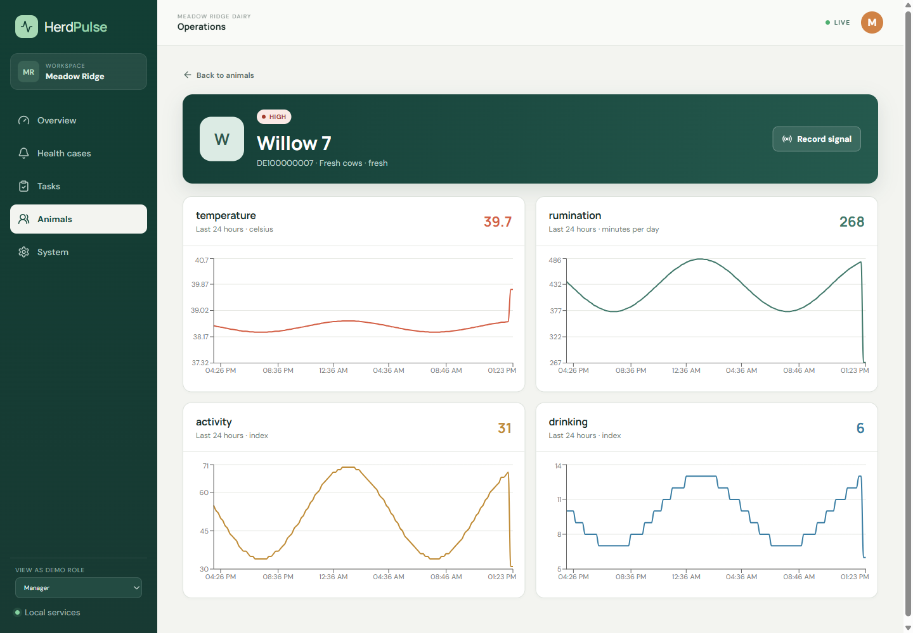
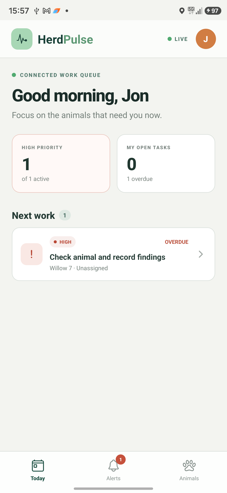
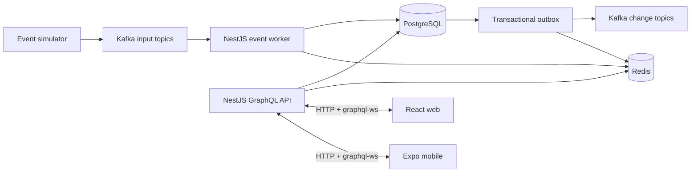

# HerdPulse

HerdPulse is a local-first herd health alert and field-work orchestration platform. It consumes telemetry, animal alerts, and device heartbeats; turns recent signals into an explainable priority; opens one active case per animal; and creates actionable work from versioned SOPs.

This is a standalone portfolio project. Its scoring is deterministic operational decision support for a fictional herd—not veterinary advice or a clinically validated model.


## What it demonstrates

- At-least-once Kafka processing with idempotent PostgreSQL effects.
- Explainable, versioned risk scoring over out-of-order animal signals.
- One-active-case orchestration, SOP-backed tasks, comments, assignments, and optimistic concurrency.
- Schema validation, transactional inbox/outbox, dead-letter routing, and safe repaired replay.
- Tenant-aware GraphQL queries, mutations, and subscriptions with demo roles or local OIDC.
- Responsive React operations UI and a focused, connected Expo companion.

## Product surfaces

| Explainable case workflow                                        | Live telemetry                                                        |
| ---------------------------------------------------------------- | --------------------------------------------------------------------- |
|  |  |

| React Native work queue                                          | React Native case explanation                                         |
| ---------------------------------------------------------------- | --------------------------------------------------------------------- |
|  |  |

The web app was visually verified at desktop and responsive widths. The Expo app was verified on a physical Android phone; the code remains iOS-compatible, but iOS verification is not claimed. More captures are available in [`docs/screenshots`](docs/screenshots).

## Architecture



PostgreSQL is authoritative. Redis holds rebuildable latest values and real-time invalidation messages. Clients refetch GraphQL data after notifications, reconnects, and mutations.

## Stack

| Layer        | Technology                                        |
| ------------ | ------------------------------------------------- |
| Web          | React 19, Vite, React Router, Recharts            |
| Mobile       | Expo SDK 54, React Native 0.81                    |
| API          | NestJS 11, schema-first GraphQL, `graphql-ws`     |
| Processing   | Kafka 4.1, KafkaJS, Zod contracts                 |
| Data         | PostgreSQL 18, Kysely, partitioned telemetry      |
| Realtime     | Redis 8 Pub/Sub with authoritative refetch        |
| Identity     | Demo-role tokens and optional local Keycloak OIDC |
| Verification | Vitest, live integration checks, Playwright, ADB  |

## Run locally

Prerequisites: Node.js 22.14+, pnpm 11, and Docker Desktop with Compose.

```bash
git clone https://github.com/fullstack-nick/HerdPulse.git
cd HerdPulse
pnpm install
pnpm env:init
pnpm infra:up
pnpm db:migrate
pnpm db:seed
pnpm demo
pnpm dev
```

Open the React app at [http://localhost:5173](http://localhost:5173). The GraphQL API is at `http://localhost:4000/graphql`; API and worker health endpoints use ports `4000` and `4001`.

Start the native companion in another terminal:

```bash
pnpm dev:mobile
```

`pnpm env:init` selects a LAN address for Android. An emulator can use `http://10.0.2.2:4000/graphql`; a USB device can instead use `adb reverse tcp:4000 tcp:4000` with a localhost client URL.

## Demo and verification

```bash
# High-risk story with duplicate and out-of-order inputs
pnpm demo

# Idempotency, schema failure, and repaired replay
pnpm --filter @herdpulse/simulator incident:duplicate
pnpm --filter @herdpulse/simulator incident:schema
pnpm --filter @herdpulse/simulator replay:dlq

# Local quality gates
pnpm check
pnpm test
pnpm test:integration
pnpm build
```

Optional dashboards start with `docker compose --profile observability up -d`: Prometheus on `9090`, Grafana on `3000`, and Jaeger on `16686`. There is intentionally no hosted deployment or GitHub Actions workflow.

## Deeper documentation

- [Engineering plan and decision record](docs/engineering-plan.md)
- [Local operations runbook](docs/runbooks/local-operations.md)
- [Duplicate-delivery incident exercise](docs/incidents/duplicate-delivery.md)
- [Slow-dashboard incident exercise](docs/incidents/slow-dashboard.md)
- [Dashboard query evidence](docs/performance/dashboard-query.sql)

Licensed under the [MIT License](LICENSE).
