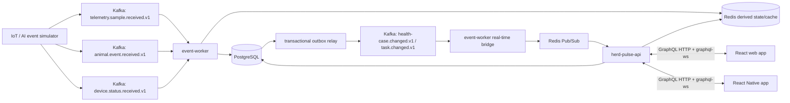

# HerdPulse

> Planning status: scope approved; implementation has not started.
>
> This is the living product and engineering plan for HerdPulse, a standalone portfolio project with its own domain model, visual identity, terminology, and implementation.

## Product thesis

HerdPulse is a real-time herd-health alert and barn-work orchestration platform. An upstream IoT/AI system already produces telemetry and animal-health events. HerdPulse consumes those inputs, correlates recent signals for each animal, prioritizes animals that need attention, creates work from farm-specific standard operating procedures (SOPs), and keeps web clients current in real time.

This is not a generic farm-management CRUD application and it is not a clinical prediction system. Its core engineering problems are event processing, explainable prioritization, multi-tenant authorization, operational workflow, time-series reads, failure recovery, and real-time client reconciliation.

## Goals

HerdPulse will:

1. Consume versioned telemetry and discrete animal events from Kafka.
2. Correlate events for the same animal over a configurable 72-hour window.
3. Calculate an explainable low, medium, or high priority using recent events, lactation phase, and farm settings.
4. Process duplicates, replays, late events, and out-of-order events safely.
5. Open or update health cases and create tasks from versioned SOPs.
6. Let authorized workers acknowledge, claim, assign, comment on, diagnose, and resolve work.
7. Push live change notifications through GraphQL subscriptions while preserving PostgreSQL as the source of truth.
8. Expose an animal timeline containing curves, alerts, reproduction events, cases, tasks, diagnoses, and resolutions.
9. Support multiple organizations, users who belong to more than one organization, IANA time zones, and localized UI text.
10. Provide connected React web and React Native clients for the same workflows.
11. Demonstrate measurable correctness, tenant isolation, performance, and observability without an oversized test suite.

## Explicit non-goals

- A real veterinary diagnosis or disease-prediction model.
- Claims that the scoring rules are clinically validated.
- Physical LoRa/bolus/base-station hardware.
- Offline/autonomous client operation or background synchronization.
- Billing, subscriptions, inventory, milk production, or full herd-management replacement.
- A custom identity provider.
- Email, SMS, or external push-notification providers.
- Kafka-based request/response between internal services.
- Many small microservices, GraphQL federation, Kubernetes, or multiple databases before the core vertical slice needs them.
- Cloud deployment or production hosting; this portfolio runs locally.

The UI must describe priorities as operational decision support, not a veterinary diagnosis. Any real pilot would require domain-expert review of rules, wording, and escalation behavior.

## Architecture at a glance

The proposed system has two backend deployables, plus a simulator, web client, and React Native client. Everything runs locally for the portfolio:

- `herd-pulse-api`: NestJS GraphQL queries, mutations, subscriptions, authentication, authorization, commands, and reads.
- `event-worker`: NestJS Kafka consumers, inbox/outbox processing, telemetry projection, scoring, case/task automation, DLQ replay, and Kafka-to-Redis live-update bridging.
- `event-simulator`: a development application that emits normal, anomalous, duplicate, delayed, out-of-order, gap, and burst traffic.
- `web`: a connected responsive React application.
- `mobile`: a connected React Native application built with Expo. It shares generated API types and design tokens with the web app, but not platform-specific UI components.



### Why the input topics are split

HerdPulse distinguishes three input stream types:

- **Telemetry samples**: high-volume numeric measurements used for curves, latest values, and aggregation.
- **Animal events**: discrete facts such as a health alert, calving confirmation, insemination, diagnosis, or heat detection.
- **Device status**: heartbeat/connectivity facts used to determine whether a device is stale.

This keeps the risk consumer independent of the full telemetry volume and permits different retention, partition counts, validation, and replay policies. The simulator and worker support all three streams from the first complete version.

### Reliability boundary

- Kafka and PostgreSQL carry durable state.
- PostgreSQL is the system of record for users, organizations, animals, events, cases, tasks, settings, and audit history.
- Redis contains rebuildable latest-value state, short-lived caches, rate limits, optional rolling-window acceleration, and subscription fan-out.
- Redis Pub/Sub is deliberately treated as an ephemeral notification channel. It provides at-most-once delivery, so the React client must invalidate/refetch authoritative GraphQL data after a notification and after every reconnect.
- The system targets **at-least-once processing plus idempotent effects**, not a misleading end-to-end “exactly once” claim across Kafka and PostgreSQL.

## Proposed technology baseline

This baseline is recommended if no contrary preference is supplied. Exact package versions will be pinned and compatibility-tested when the repository is bootstrapped.

| Area | Proposed choice | Rationale |
| --- | --- | --- |
| Runtime | Node.js 24 LTS, TypeScript | Node 24 is an active LTS line as of the research date. |
| Workspace | pnpm workspaces; add a build orchestrator only if needed | Keeps a small monorepo understandable and avoids framework-specific workspace lock-in. |
| Backend | NestJS 11, Fastify adapter | Matches the project goal and keeps HTTP overhead low. |
| GraphQL | Nest GraphQL, Apollo Server, code-first schema, `graphql-ws` | Nest recommends `graphql-ws`; the deprecated subscription transport will not be used. |
| Web | React 19, Vite, Apollo Client, generated GraphQL types | Small, current, and suitable for responsive real-time screens. |
| Mobile | React Native with Expo, Expo Router, Apollo Client | Keeps the portfolio cross-platform while avoiding native-project and deployment complexity. |
| Database | PostgreSQL 18, `pg`, Kysely, SQL migrations | SQL-first access is a better fit for RLS, partitions, partial indexes, query plans, and critical hand-tuned reads than a heavy entity ORM. |
| Streaming | Apache Kafka 4.x in KRaft mode; KafkaJS behind an adapter | Nest has first-class KafkaJS support. The adapter keeps a later move to Confluent's native JavaScript client possible if benchmarks justify it. |
| Cache/fan-out | Redis 8-compatible deployment using the official `redis` client | Derived state, throttling, and cross-instance notification fan-out only. |
| Contracts | AsyncAPI 3.1 plus JSON Schema and runtime validation | Human- and machine-readable contracts without requiring a schema-registry service on day one. |
| Tests | Vitest, targeted Testcontainers integration tests, Playwright, and a small smoke-load script | Verifies important behavior without turning the portfolio into a testing project. |
| Telemetry | OpenTelemetry/OTLP, Prometheus, Grafana, structured JSON logs | Vendor-neutral traces and metrics; local observability can run through Compose profiles. |
| Local platform | Docker Compose with health checks | One command for a realistic local stack without starting with Kubernetes. |

The accepted scope decisions are recorded under [Accepted decisions](#accepted-decisions).

## Local setup

HerdPulse is intentionally local-only. There is no deployment account, hosted environment, or production infrastructure. Phase 0 will implement and keep these commands current.

### Prerequisites

- Git.
- Node.js 24 LTS with Corepack/pnpm.
- Docker Desktop with Compose.
- Android Studio/SDK plus either a USB-debugging-enabled Android phone or emulator for native verification. The current development machine has both a connected Android phone and an API 36.1 emulator available.
- Optional: Expo Go on a physical device connected to the same network.

### Planned first-time setup

```bash
git clone https://github.com/fullstack-nick/HerdPulse.git
cd HerdPulse
corepack enable
pnpm install
pnpm env:init
docker compose --profile auth up -d postgres redis kafka keycloak
pnpm db:migrate
pnpm db:seed
```

The `auth` profile starts the local Keycloak development realm. A committed realm export and non-secret demo accounts make the portfolio reproducible. `.env.example` documents every setting; `pnpm env:init` creates the ignored local `.env` without embedding credentials in the repository.

### Run the connected clients

```bash
# API, worker, simulator, and web client
pnpm dev

# React Native/Expo client in a second terminal
pnpm --filter @herd-pulse/mobile start
```

The Expo terminal can open the installed Android emulator or connect to the USB-attached phone through Expo Go. Both clients use the same local GraphQL API. Android uses the configured development host rather than assuming that `localhost` points to the laptop.

### Local verification

```bash
pnpm check
pnpm test
pnpm test:integration
pnpm test:e2e
```

`pnpm check` covers formatting, linting, and type checking. The other commands remain intentionally small: fast behavior tests by default, a focused infrastructure suite, and one critical browser/native workflow. Performance scripts are run deliberately, not on every edit.

## Hexagonal boundaries

The domain and application packages must not import NestJS, GraphQL, Kafka, Redis, or database decorators.

```text
domain
  entities, value objects, policies, state machines, domain events
       ↑
application
  commands, queries, use cases, ports, transaction boundary
       ↑
adapters
  GraphQL, Kafka, PostgreSQL/Kysely, Redis, OIDC, clocks, IDs
       ↑
composition roots
  herd-pulse-api, event-worker, event-simulator
```

Ports will include repositories, unit-of-work, event publisher, current user/tenant, clock, ID generator, authorization policy, and notification fan-out. Framework-specific exceptions will be translated at the adapter boundary. This is genuine dependency direction, not folders that merely have architectural names.

## Core domain model

### Primary records

```text
organization
organization_setting
user
organization_membership
animal
animal_group
device
telemetry_sample
telemetry_hourly
animal_event
health_case
risk_assessment
health_case_event
sop
sop_version
sop_trigger
task
task_assignment_event
task_comment
notification_preference
inbox_message
outbox_message
audit_log
```

Every tenant-owned record contains `organization_id`. Tenant-local relationships also use composite foreign keys such as `(organization_id, animal_id)` so a programming mistake cannot link a Farm A case to a Farm B animal.

### Important fields and constraints

```text
organization
- id
- name
- timezone                 # IANA name such as Europe/Berlin
- default_language
- created_at

organization_membership
- organization_id
- user_id
- role                     # OWNER | MANAGER | WORKER | VET | CONSULTANT
- preferred_language
- active

animal
- id
- organization_id
- official_id              # ear-tag/business identifier; tenant-scoped unique
- display_name
- group_id
- device_id
- lactation_phase
- parity
- last_calving_at
- expected_calving_at
- archived_at

telemetry_sample
- organization_id
- animal_id
- device_id
- metric                   # TEMPERATURE | RUMINATION | ACTIVITY | DRINKING | PH
- occurred_at
- received_at
- value
- unit
- source
- external_sample_id

animal_event
- id
- organization_id
- animal_id
- source
- external_event_id
- type
- occurred_at
- received_at
- schema_version
- typed/filterable fields
- raw_payload JSONB

health_case
- id
- organization_id
- animal_id
- priority
- status                   # OPEN | ACKNOWLEDGED | IN_PROGRESS | RESOLVED
- score
- current_risk_assessment_id
- opened_at
- acknowledged_at
- resolved_at
- version                  # optimistic concurrency

risk_assessment
- id
- organization_id
- health_case_id
- ruleset_version
- window_start
- window_end
- score
- priority
- reason_codes JSONB       # structured codes/parameters, not rendered English
- created_at

task
- id
- organization_id
- health_case_id
- sop_version_id
- title_key
- instruction_snapshot
- assignee_user_id
- due_at
- status                   # OPEN | CLAIMED | COMPLETED | CANCELLED
- version
```

Key constraints include:

- `UNIQUE (organization_id, source, external_event_id)` for discrete upstream events.
- A stable equivalent for telemetry samples when the upstream provides one; otherwise a documented deterministic fingerprint.
- Tenant-scoped uniqueness for animal official IDs and device IDs.
- A decision-dependent partial unique constraint for at most one active case per animal.
- Unique inbox identities per consumer/event and unique outbox event IDs.
- Check constraints for valid score ranges, timestamps, and state-dependent fields.

### Case and task state

HerdPulse uses one active health case per animal. New related alerts recalculate and append to that case; a configurable quiet period closes correlation. Reopening within 24 hours updates the previous case's history, while a later recurrence creates a new case.

A case and its task are related but not the same state machine. Resolving a case must not silently complete a task, and completing a task must require an explicit resolution policy before it resolves a case. All transitions append immutable history and audit records.

SOPs are versioned. A task keeps an instruction snapshot and `sop_version_id` so later edits do not rewrite historical work.

## Input event vocabulary

The simulator will use a focused subset of publicly documented concepts:

- `TEMPERATURE_INCREASE`
- `TEMPERATURE_DROP`
- `RUMINATION_DECREASE`
- `INSUFFICIENT_WATER_INTAKE`
- `DRINKING_CYCLES_INCREASED`
- `ACTIVITY_INCREASE`
- `ACTIVITY_DROP`
- `HEAT_STRESS`
- `IMMINENT_CALVING`
- `HEAT_DETECTED`
- `INSEMINATION_RECORDED`
- `PREGNANCY_RESULT_RECORDED`
- `CALVING_CONFIRMED`
- `DIAGNOSIS_RECORDED`

The source's event name/code is retained in the raw payload, while HerdPulse maps it to a stable internal vocabulary.

### Event envelope

```json
{
  "eventId": "01K...",
  "eventType": "TEMPERATURE_INCREASE",
  "schemaVersion": 1,
  "organizationId": "farm-de-001",
  "animalId": "animal-092",
  "officialId": "DE000000092",
  "deviceId": "bolus-070000092",
  "occurredAt": "2026-08-02T08:14:00Z",
  "receivedAt": "2026-08-02T08:17:32Z",
  "data": {
    "value": 1.2,
    "unit": "DELTA_CELSIUS"
  },
  "correlationId": "01K...",
  "traceparent": "00-...",
  "source": "simulator"
}
```

All contracts will be documented in AsyncAPI and validated at producers and consumers. Breaking changes require a new schema/topic version. Events are keyed by `organizationId:animalId`, preserving per-animal log order without assuming that `occurredAt` order is perfect.

## Explainable priority calculation

Version 1 uses deterministic, organization-configurable rules:

```text
Temperature increase                     +2
Temperature drop                         +2
Rumination decrease                      +2
Water-intake anomaly                     +1
Activity anomaly                         +1
Two or more different alert types        +2
Animal is fresh or close to calving      +2
Same case reopened within 24 hours       +1
```

```text
0-2  = LOW
3-5  = MEDIUM
6+   = HIGH
```

The ruleset, lactation windows, thresholds, case-opening threshold, task-creation threshold, due-time policy, and auto-assignment behavior are versioned per organization.

The worker stores structured explanations, for example:

```json
[
  { "code": "TEMPERATURE_INCREASE", "points": 2 },
  { "code": "RUMINATION_DECREASE", "points": 2, "minutesAfterPrevious": 42 },
  { "code": "FRESH_COW", "points": 2, "daysPostpartum": 4 }
]
```

The API renders these codes through localized message catalogs. Storing only a human-readable English sentence would make audit, localization, and future ruleset changes brittle.

For a late event, the worker acquires a transaction-scoped per-animal lock, persists the event idempotently, and recalculates only the affected animal's 72-hour window using `occurredAt`. `receivedAt` remains available for lag and connectivity analysis.

## GraphQL API

The schema will be code-first, generated into a checked schema artifact, and consumed through generated client types.

### Queries

```graphql
viewer: Viewer!

herdDashboard(organizationId: ID!): HerdDashboard!

healthCases(
  organizationId: ID!
  status: HealthCaseStatus
  priority: Priority
  groupId: ID
  first: Int!
  after: String
): HealthCaseConnection!

healthCase(id: ID!): HealthCase
animal(id: ID!): Animal

animalTimeline(
  animalId: ID!
  from: DateTime!
  to: DateTime!
  resolution: TimelineResolution
): AnimalTimeline!

tasks(
  organizationId: ID!
  assigneeId: ID
  status: TaskStatus
  first: Int!
  after: String
): TaskConnection!
```

### Mutations

```graphql
acknowledgeHealthCase(id: ID!, expectedVersion: Int!): HealthCase!
claimTask(taskId: ID!, expectedVersion: Int!): Task!
assignTask(taskId: ID!, userId: ID!, expectedVersion: Int!): Task!
addTaskComment(taskId: ID!, body: String!): TaskComment!

completeTask(
  taskId: ID!
  resolution: String!
  diagnosisCode: String
  expectedVersion: Int!
): Task!

resolveHealthCase(
  id: ID!
  resolution: String!
  expectedVersion: Int!
): HealthCase!

updateRiskSettings(
  organizationId: ID!
  input: RiskSettingsInput!
  expectedVersion: Int!
): OrganizationSettings!

recordAnimalEvent(animalId: ID!, input: AnimalEventInput!): AnimalEvent!
```

### Subscriptions

```graphql
healthCaseChanged(organizationId: ID!): HealthCaseChange!
taskChanged(organizationId: ID!): TaskChange!
deviceStatusChanged(organizationId: ID!): DeviceStatusChange!
```

Subscription payloads carry the entity ID, entity version, change type, and current projection. The browser treats them as invalidation hints, applies an event only when its version is newer, and refetches after reconnect. This handles duplicates and the fact that Redis Pub/Sub does not replay missed messages.

### GraphQL safeguards

- Relay-style cursor pagination with hard page-size limits; no offset pagination on large lists.
- Request-scoped DataLoaders and explicit query tests to prevent N+1 reads.
- Depth, breadth, batch, alias, and query-complexity budgets.
- Production persisted/trusted documents if the API remains first-party only.
- Input length/range validation and safe rendering of user comments.
- Masked production errors with stable `extensions.code` values such as `CONFLICT`, `FORBIDDEN`, and `STALE_VERSION`.
- `graphql-ws` authentication on connect and subscribe, token expiry/reconnect support, and authorization of every emitted resource.

## Client experiences

The web application contains four polished responsive screens. The React Native application is a focused connected companion for the same daily workflow, not a second independent product.

### 1. Herd overview

- High-, medium-, and low-priority case counts.
- Animals requiring attention.
- Tasks due today and overdue.
- Devices that have stopped reporting.
- Live arrival/escalation of health cases.

### 2. Priority queue

- Filters for priority, group, lactation phase, alert type, assignee, and acknowledgement status.
- Stable cursor pagination.
- New/changed rows without a page refresh.
- Clear stale/conflict handling if another worker updates the same case.

### 3. Animal detail

- Current state, group, lactation context, and device status.
- Temperature, rumination, activity, drinking, and optional pH curves.
- Health and reproductive markers on the graph.
- Open case, score explanation, task, diagnoses, and resolution history.
- Downsampled graph data for long date ranges.

### 4. Task workflow

- Claim or assign a task.
- Read the exact SOP version used when the task was created.
- Add a note and record the animal check.
- Enter a diagnosis/resolution.
- Complete the task with optimistic-concurrency conflict feedback.

The recommended visual direction is a high-contrast, utilitarian farm-operations interface with large touch targets, restrained status colors, and WCAG 2.2 AA behavior. Priority must never be communicated by color alone.

### React Native scope

The Expo app includes:

- A compact herd summary and live high-priority count.
- The priority queue with essential filters.
- Animal health summary, recent signals, and the active case.
- Task claim, note, diagnosis/resolution, and completion flows.
- In-app live updates through the same GraphQL subscriptions as the web client.

Administration, risk-setting editors, SOP authoring, dense historical charts, and bulk operations remain web-only. The mobile app is connected-only: after a disconnect it shows stale/offline state, disables mutations, reconnects, and refetches. It has no background worker, local mutation outbox, or autonomous synchronization.

### Mandatory visual verification

Every UI change must be inspected through a screenshot before it is considered complete:

- Web changes: Playwright screenshots at the affected desktop and responsive viewport.
- React Native changes: a screenshot from the connected Android phone (or the emulator fallback) for every affected screen/state.
- Loading, empty, populated, error, and conflict states are captured when the change touches them.
- The implementation pass compares the screenshot against the intended hierarchy, clipping, spacing, contrast, and touch-target behavior; passing DOM/component tests alone is insufficient.
- Current representative screenshots are kept under `docs/screenshots/`. Temporary debugging captures stay out of Git.

The code remains compatible with iOS through Expo-supported APIs, but this Windows-based local portfolio will not claim iOS visual verification unless it is run on a Mac or physical iOS device.

## Multi-tenancy, authentication, and authorization

The recommended model is OIDC/OAuth 2.0 with short-lived JWT access tokens and an external identity provider. Local development can use a containerized provider or signed test tokens; production will not store passwords in HerdPulse.

Authorization is membership- and permission-based:

| Role | Intended permissions |
| --- | --- |
| OWNER | Organization administration, settings, memberships, all workflow actions. |
| MANAGER | SOP/settings management, assignment, acknowledgement, resolution, reporting. |
| WORKER | Read assigned farm data, claim/update/complete permitted tasks, add comments. |
| VET | Read clinical context, add diagnoses/resolutions, participate in cases. |
| CONSULTANT | Read-only by default, with explicit organization grants if needed. |

Protection is layered:

1. JWT issuer, audience, expiry, and signature validation.
2. GraphQL guards and application policies that validate membership and action permissions.
3. Repository methods that require a tenant context rather than accepting an optional tenant filter.
4. Composite tenant foreign keys and unique constraints.
5. PostgreSQL row-level security as defense in depth, using transaction-local tenant context and a non-owner runtime role.
6. Cross-organization negative tests for every query, mutation, subscription, and indirect object lookup.

An `organizationId` supplied by a client is a selection, never authorization evidence. WebSocket filters must load/recheck the membership rather than trusting a channel name or payload tenant ID.

## Event processing and failure handling

### Consumer transaction

For each durable input event:

1. Validate the envelope and supported schema version.
2. Begin a PostgreSQL transaction and acquire the per-animal transaction lock when needed.
3. Insert the inbox identity; stop safely if it already exists.
4. Persist the event/sample and calculate/update projections, case, task, assessment, and audit records.
5. Insert resulting domain messages into the outbox in the same transaction.
6. Commit the database transaction.
7. Commit the Kafka offset only after the database commit succeeds.

The outbox relay claims rows with `FOR UPDATE SKIP LOCKED`, publishes them to Kafka, and marks them published. A crash between publish and marking may republish, so downstream handlers must also be idempotent.

### Retries and dead letters

- Bounded exponential backoff with jitter for transient failures.
- No infinite partition blocking.
- A versioned DLQ envelope containing the original record, topic/partition/offset, failure category, attempts, timestamps, trace IDs, and redacted error details.
- An operator CLI to inspect, validate, and replay selected dead letters.
- Poison/unsupported messages go to the DLQ; infrastructure outages leave offsets uncommitted.
- Replay tests assert that cases, tasks, comments, assignments, notifications, and audit history are not duplicated.

### Concurrency

Kafka ordering by animal reduces conflicting worker updates but does not eliminate API/worker or replay races. The design uses:

- Per-animal transaction-scoped advisory locks for case recalculation.
- Optimistic `version` checks for employee commands.
- Unique constraints as the final arbiter of idempotency.
- Clear GraphQL conflict responses containing enough information for a client refetch.

## PostgreSQL and time-series plan

The representative portfolio seed uses this load profile:

```text
3 organizations
500 animals per organization
30 days of 10-minute sample intervals
6.48 million animal/interval observations
```

At one row per observation, that is 6.48 million rows. The proposed narrow `metric/value` schema produces one row per metric, so four metrics at every interval would produce 25.92 million rows. We will keep a 6.48-million-row baseline profile and a multi-metric stress profile, with seed manifests recording the exact cadence and distribution. These are portfolio benchmarks, not production storage estimates.

Proposed storage work:

- Range partition `telemetry_sample` by `occurred_at` (monthly initially; benchmark weekly if pruning or maintenance benefits).
- B-tree index for animal curves, beginning with `(organization_id, animal_id, metric, occurred_at DESC)`.
- Evaluate a BRIN time index for large append-oriented partitions rather than adding it speculatively.
- Partial indexes for active cases and incomplete/overdue tasks.
- Incrementally upsert `telemetry_hourly` buckets. A whole materialized-view refresh is a poor fit for late readings.
- Typed columns for frequently filtered values; retain raw JSON only for source fidelity and uncommon attributes.
- Keyset/cursor pagination using deterministic tie-breakers.
- SQL migrations that can upgrade populated data and support safe concurrent index creation where appropriate.
- Checked-in `EXPLAIN (ANALYZE, BUFFERS)` evidence and before/after measurements under `docs/performance`.

Redis may accelerate a risk window, but the result must remain reconstructable from PostgreSQL/Kafka. The first correct implementation can query the indexed 72-hour animal window; Redis optimization should be driven by profiling.

## Time, localization, and units

- Store event instants as UTC `timestamptz`; preserve the organization's IANA time zone for schedules and display.
- Test daylight-saving gaps and overlaps explicitly.
- Store canonical units with the measurement; convert only at presentation/integration boundaries.
- Store explanation/title/instruction keys plus parameters, not pre-rendered translated alert text.
- Ship English only. Message keys and parameters still keep user-facing text separate from stored facts so a later locale does not require a data migration.
- A user's language may override the organization's default without changing historical facts.

## Observability and operations

Structured logs include `service`, `environment`, `organizationId`, `animalId`, `eventId`, `caseId`, `taskId`, `correlationId`, `traceId`, Kafka topic/partition/offset, and outcome. User comments, tokens, and unnecessary personal data are excluded.

Metrics include:

- Kafka consumer lag, processed rate, retries, duplicates, invalid messages, and DLQ count.
- End-to-end event age (`now - occurredAt`) and processing latency (`processedAt - receivedAt`).
- Outbox backlog age and publish failures.
- GraphQL latency/error rate by named operation, rejected query cost, and active subscriptions.
- PostgreSQL pool saturation and slow-query latency.
- Redis latency, hit rate, fan-out failures, and reconnects.
- Cases opened/escalated/resolved by priority, overdue tasks, and stale devices.
- Subscription publication-to-client-observed latency in end-to-end tests.

OpenTelemetry traces propagate through HTTP, Kafka headers, worker processing, PostgreSQL, Redis, and outbox publication. The local optional observability profile should expose Prometheus, Grafana, an OpenTelemetry Collector, and a trace backend without making them mandatory for the fastest development loop.

Runbooks will cover broker/database/Redis outages, consumer lag, outbox backlog, DLQ replay, schema rejection, stale devices, cache rebuild, and subscription disconnects.

## Lean testing strategy

Tests exist to verify behavior that is expensive to rediscover manually. The portfolio will prefer a few high-value tests over broad coverage targets or duplicated tests at every layer.

### Fast behavior tests

- Scoring totals/reason codes and the main case/task state transitions.
- Duplicate and late-event invariants.
- Optimistic-concurrency conflicts and time-zone edge cases.

### Focused integration tests

- One Testcontainers suite proves migrations, tenant isolation, inbox/outbox idempotency, and the critical Kafka-to-PostgreSQL path using real PostgreSQL/Kafka/Redis.
- Contract fixtures cover supported event versions and rejection of malformed/unsupported messages.
- A replay test verifies that cases and tasks are not duplicated.

### End-to-end smoke tests

- One Playwright scenario covers alert arrival, live web update, task completion, reconnect/refetch, and a screenshot.
- One connected Android phone scenario covers the mobile priority/task path and captures screenshots; the emulator is the fallback.
- Cross-organization access gets a compact negative matrix across query, mutation, and subscription boundaries.

### Performance evidence

- Seed manifests record the exact data shape and machine profile.
- A deliberate smoke-load script checks the dashboard target and two-second live-update target.
- Query plans and before/after incident measurements are checked into `docs/performance`; large load suites do not run on every change.

There is no coverage-percentage target. Tests that do not protect a meaningful rule, boundary, regression, or workflow should not be added.

## Repository structure

```text
HerdPulse/
|-- apps/
|   |-- api/
|   |-- event-worker/
|   |-- event-simulator/
|   |-- web/
|   `-- mobile/
|-- packages/
|   |-- domain/
|   |-- application/
|   |-- database/
|   |-- event-contracts/
|   |-- graphql-client/
|   |-- design-tokens/
|   |-- observability/
|   `-- testing/
|-- infrastructure/
|   |-- compose/
|   `-- monitoring/
|-- migrations/
|-- docs/
|   |-- adr/
|   |-- contracts/
|   |-- diagrams/
|   |-- incidents/
|   |-- performance/
|   |-- runbooks/
|   `-- screenshots/
|-- .github/workflows/
`-- docker-compose.yml
```

## Delivery plan

### Phase 0: repository and foundation

- Initialize Git and create the public `fullstack-nick/HerdPulse` repository with the MIT license.
- Add concise ADRs for the accepted decisions.
- Bootstrap the pnpm workspace, quality gates, Compose dependencies, configuration validation, and CI skeleton.
- Define the initial AsyncAPI contracts and database migration conventions.
- Make the documented local setup commands work from a clean checkout.

Exit: clean checkout installs, checks, and starts healthy infrastructure predictably.

### Phase 1: complete vertical slice

```text
simulated temperature alert
-> Kafka
-> idempotent worker transaction
-> PostgreSQL health case
-> GraphQL query
-> React priority queue
```

- One organization, seeded user/membership, animals, and one alert type.
- One correct case path before charts, caching, or deployment work.
- Trace/log correlation across the entire path.

Exit: a deterministic automated end-to-end test proves the slice.

### Phase 2: real-time work orchestration

- GraphQL subscriptions and reconnect/refetch behavior.
- Multi-signal score and structured explanations.
- Versioned SOP and task creation.
- Claim, assignment, comments, diagnosis, completion, and case resolution.
- Roles, audit history, and Redis latest-state/fan-out.
- Expo app shell, priority queue, animal summary, and task workflow.
- Screenshot verification for every web and mobile UI increment.

Exit: the main demo works from the web and connected Android phone for two concurrent users without stale writes or tenant leakage.

### Phase 3: failure handling and scale

- Complete inbox/outbox path, retries, DLQ, and replay CLI.
- Duplicate, out-of-order, late, gap, and burst simulations.
- Full telemetry seed, partitions, aggregate table, query-plan analysis, and load tests.
- Metrics, dashboards, alerts, and runbooks.

Exit: replay is idempotent and performance targets pass on the agreed machine profile.

### Phase 4: product realism

- Animal curves and unified timeline.
- Reproductive events, device staleness, farm risk settings, notification preferences.
- English message catalog and metric-unit presentation.
- Web/native accessibility and responsive polish, verified through screenshots.

Exit: the ten-minute demo scenario below is reliable and documented.

### Optional Phase 5: brownfield incident lab

The portfolio will include two incident narratives without keeping known duplicate or N+1 defects on the main development line. Reproduce them safely through historical tags, isolated fixtures, or a dedicated lab branch and document:

1. **Duplicate urgent cases** after a consumer restart: diagnosis, inbox/constraint fix, repair migration, replay test, and postmortem.
2. **Slow dashboard** after several million rows: captured operation, query plan, N+1/index/aggregation/cache fix, before/after measurements, regression test, and postmortem.

This preserves the learning objective without making broken behavior the foundation of the product.

## Definition of done

- `docker compose up --build` starts healthy Kafka, PostgreSQL, Redis, API, worker, simulator, and web services.
- The Expo client starts with the documented pnpm command and connects to the same local API from the USB-attached Android phone, with an emulator fallback.
- Compose uses health checks/readiness rather than relying on container start order.
- The simulator produces normal, anomalous, duplicate, out-of-order, delayed, connectivity-gap, and burst scenarios.
- Replaying the complete input stream creates no duplicate cases, tasks, comments, assignments, notifications, or audit effects.
- A new high-priority case reaches connected local web and mobile clients within two seconds.
- The open-case dashboard query remains below the agreed p95 target with the full seed.
- Focused tests prove the critical scoring, replay, concurrency, and cross-organization boundaries.
- GraphQL lists use bounded cursor pagination, critical query counts are asserted, and demand controls are active.
- Populated-database migrations are forward-tested, including partition/index changes and repair migrations.
- Kafka contracts are versioned, validated, and documented through AsyncAPI.
- PostgreSQL remains correct after Redis is flushed; rebuild procedures are tested.
- Metrics, structured logs, traces, and a small local operational dashboard exist.
- GitHub Actions performs formatting, linting, type checking, focused tests, migration validation, and application builds. There is no deployment job.
- Every UI change has a reviewed web or Android screenshot, and representative screenshots are available in the public repository.
- The repository includes ADRs, a data-flow diagram, local setup guidance, performance evidence, runbooks, and the two incident postmortems.

## Final demo scenario

1. A lactating animal receives a temperature-increase event.
2. Forty minutes later, a rumination-decrease event arrives.
3. One input is duplicated and another arrives out of `occurredAt` order.
4. The system correlates the inputs and opens one explainable high-priority case.
5. A versioned SOP creates a task and assigns or offers it according to farm policy.
6. The React web and React Native priority queues update through GraphQL subscriptions.
7. An employee acknowledges the case, examines the animal, records a diagnosis/note, and completes the task.
8. The animal timeline shows samples, alerts, assessment, task, diagnosis, and resolution.
9. The original Kafka input is replayed.
10. No domain effect is duplicated.
11. The demo shows verified web/mobile screenshots, the dashboard query plan, measured latency, trace, and relevant operational metrics.

## Accepted decisions

| ID | Accepted choice |
| --- | --- |
| D1 | HerdPulse is a standalone portfolio/interview project in a public GitHub repository. It runs locally and is not deployed. |
| D2 | Include the duplicate-case and slow-dashboard incident narratives through isolated fixtures/history, never as known defects on the main line. |
| D3 | Use an OIDC adapter with local Keycloak in a Compose profile and reproducible demo identities. |
| D4 | Use one active case per animal, allow multiple versioned tasks, and create a new case after the configured recurrence quiet period. This interprets the user's “yes” as acceptance of the proposed default. |
| D5 | Ingest separate raw telemetry, discrete animal-event, and device-heartbeat streams. |
| D6 | Web and mobile clients are connected-only. Do not build client outboxes, autonomous workers, background sync, or offline mutations. |
| D7 | Create the public `fullstack-nick/HerdPulse` GitHub repository with GitHub Actions and no deployment workflow. |
| D8 | Use a 6.48-million-row baseline and 25.92-million-row multi-metric stress profile. This is portfolio evidence, not a production capacity promise or retention policy. |
| D9 | Use clearly labeled deterministic demo scoring with versioned settings and explanations; it is not clinical advice. |
| D10 | Ship English only. Store UTC instants, retain organization IANA time zones, and use Celsius/metric canonical measurements. |
| D11 | Use in-app GraphQL subscription updates on web and mobile only. Do not integrate email, SMS, or external push providers. |
| D12 | Use a clean, high-contrast, mobile-first operations design with a small token set. Every UI change requires screenshot review. |
| D13 | Build a focused React Native companion with Expo for summary, priority, animal context, and task workflows; verify it on the USB-attached Android phone, keep an emulator fallback, and keep the code iOS-compatible without claiming iOS verification. |

## Publication decisions

The public-repository choices are confirmed:

1. Repository: `fullstack-nick/HerdPulse`, public.
2. License: MIT.
3. Native verification: connected Android phone, with the emulator as fallback; retain iOS-compatible Expo code without claiming iOS verification.

## Technical research basis

- [NestJS Kafka transport](https://docs.nestjs.com/microservices/kafka) — KafkaJS integration and keyed event messages.
- [NestJS GraphQL subscriptions](https://docs.nestjs.com/graphql/subscriptions) — current `graphql-ws` guidance, connection authentication, and production Pub/Sub warning.
- [Apache Kafka delivery semantics](https://kafka.apache.org/41/design/design/) — at-most-once, at-least-once, and the scope of Kafka transactions.
- [Apache Kafka 4.0 KRaft announcement](https://kafka.apache.org/blog/2025/03/18/apache-kafka-4.0.0-release-announcement/) — ZooKeeper-free deployment.
- [AsyncAPI Kafka tutorial](https://www.asyncapi.com/docs/tutorials/kafka) and [Kafka bindings](https://www.asyncapi.com/docs/reference/bindings/kafka) — machine-readable event contracts.
- [Redis Pub/Sub delivery semantics](https://redis.io/docs/latest/develop/pubsub/) — at-most-once fan-out and the distinction from Redis Streams.
- [PostgreSQL declarative partitioning](https://www.postgresql.org/docs/current/ddl-partitioning.html), [row security](https://www.postgresql.org/docs/current/ddl-rowsecurity.html), [indexes](https://www.postgresql.org/docs/current/indexes.html), and [advisory locks](https://www.postgresql.org/docs/current/functions-admin.html) — storage, tenant isolation, read performance, and per-animal serialization.
- [GraphQL security guidance](https://graphql.org/learn/security/) — bounded pagination, trusted documents, depth/breadth/batch controls, complexity, rate limiting, and error masking.
- [GraphQL over WebSocket recipes](https://the-guild.dev/graphql/ws/recipes) — authentication, token refresh, retry, and reconnect behavior.
- [OpenTelemetry JavaScript](https://opentelemetry.io/docs/languages/js/) — current Node.js tracing/metrics support and OTLP instrumentation.
- [Node.js release status](https://nodejs.org/en/about/previous-releases) and [PostgreSQL version policy](https://www.postgresql.org/support/versioning/) — supported runtime/database baselines as of the research date.
- [Docker Compose startup order and health checks](https://docs.docker.com/compose/how-tos/startup-order/) — deterministic local startup readiness.

## Decision record

The accepted choices above will be captured as concise ADRs during Phase 0. New ADRs are added only for decisions with meaningful alternatives and lasting architectural consequences.

## License

HerdPulse is available under the [MIT License](LICENSE).
